# Agentic Android Migration POC — AI Force End-to-End Walkthrough

This README documents, step by step, how the **AndroidMigrationModernization-SureshPanneerSelvam** use case was built, executed, and published inside HCLTech's **AI Force** platform (`https://aiforce.hcltech.com`). It covers the full journey — from signing in, through the multi-agent migration pipeline (Supervisor Pattern), to publishing the finished use case in the catalogue.

Screenshots embedded below were recovered from the working notes captured in OneNote (`AIForceCodeMigrations.one`) and are stored locally at [docs/screenshots](docs/screenshots).

> **Target application migrated**: Google's archived `android-BasicNetworking` sample (Java, legacy support library, deprecated `ConnectivityManager`/`NetworkInfo` APIs) → modern Kotlin + AndroidX + `ConnectivityManager.NetworkCallback`/`NetworkCapabilities`.

---

## High-Level Flow

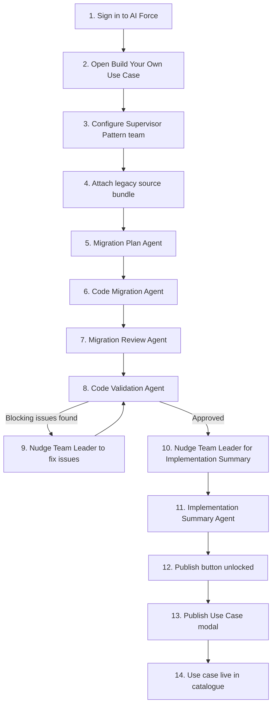
```mermaid
flowchart TD
    A[1. Sign in to AI Force] --> B[2. Open Build Your Own Use Case]
    B --> C[3. Configure Supervisor Pattern team]
    C --> D[4. Attach legacy source bundle]
    D --> E[5. Migration Plan Agent]
    E --> F[6. Code Migration Agent]
    F --> G[7. Migration Review Agent]
    G --> H[8. Code Validation Agent]
    H -->|Blocking issues found| I[9. Nudge Team Leader to fix issues]
    I --> H
    H -->|Approved| J[10. Nudge Team Leader for Implementation Summary]
    J --> K[11. Implementation Summary Agent]
    K --> L[12. Publish button unlocked]
    L --> M[13. Publish Use Case modal]
    M --> N[14. Use case live in catalogue]
```

---

## Step 1 — Sign in to AI Force

Navigate to `https://aiforce.hcltech.com` and authenticate using Microsoft Entra ID (SSO) or a username/password login. Once signed in, you land on the AI Force home page with the left-hand navigation rail exposing all studios: **Home, Projects, Use Cases Catalog, Build Your Own Use Case, Prompt Studio, Tool Studio, RAG Studio, Agentic AI Studio, MCP Studio, Governance and Evaluation Studio**.

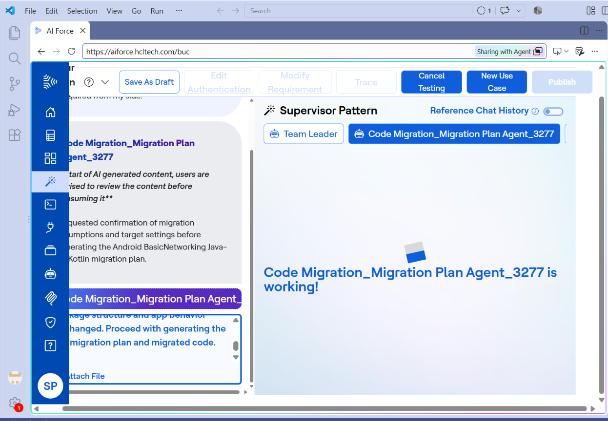

---

## Step 2 — Open "Build Your Own Use Case"

From the navigation rail, select **Build Your Own Use Case (BUC)**. This is AI Force's agentic workspace for composing a custom multi-agent pipeline, either via the **Supervisor Pattern** (conversational multi-agent chat orchestrated by a Team Leader) or the **Graphical Pattern** (DAG node builder). For this POC the **Supervisor Pattern** was used.

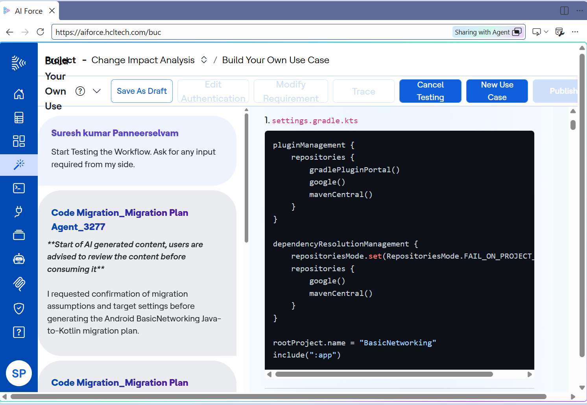

---

## Step 3 — Attach the legacy source as a requirement

The initial requirement box only accepts document/media formats (`.txt`, `.doc`, `.docx`, `.pdf`, `.pptx`, images, audio, video) — raw source files (`.java`, `.xml`, `.gradle`) are rejected. To work around this, the legacy project's key files (root `build.gradle`, `Application/build.gradle`, `AndroidManifest.xml`, `MainActivity.java`) were bundled into a single `legacy_source_bundle.txt` and attached here, alongside the natural-language migration prompt describing the desired modernization outcome.

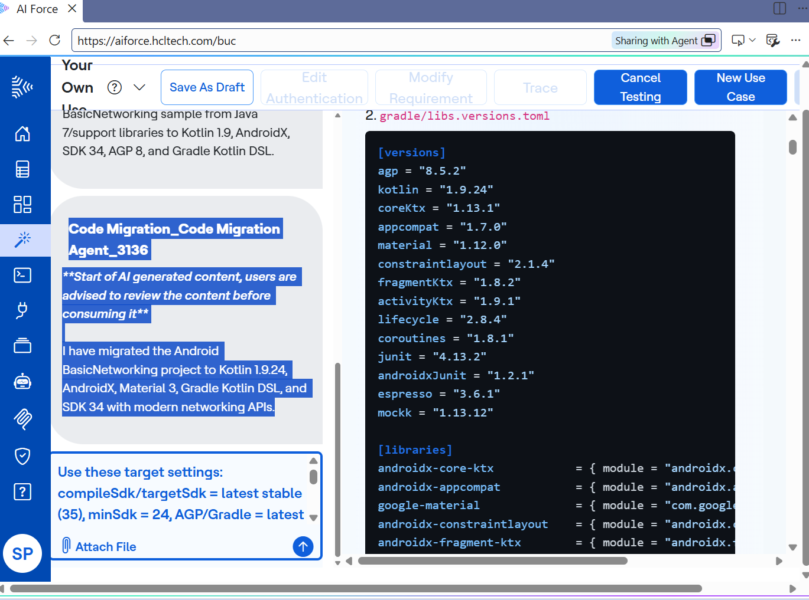

---

## Step 4 — Migration Plan Agent

The first agent in the Supervisor chain, the **Migration Plan Agent**, analyzes the attached legacy code and produces a structured modernization plan: Gradle/AGP upgrade path, AndroidX migration steps, Java→Kotlin conversion strategy, and the deprecated connectivity API replacement approach.

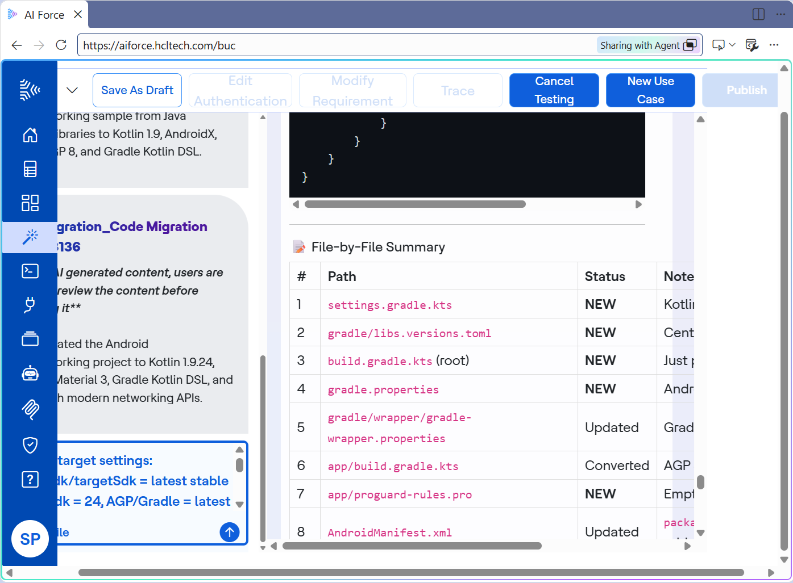

---

## Step 5 — Code Migration Agent

Next, the **Code Migration Agent** executes the plan and generates the actual migrated project: Kotlin DSL Gradle files (`settings.gradle.kts`, `build.gradle.kts`), AndroidX-based `MainActivity.kt`, and a new `NetworkMonitor.kt` built on `ConnectivityManager.NetworkCallback` + `NetworkCapabilities`.

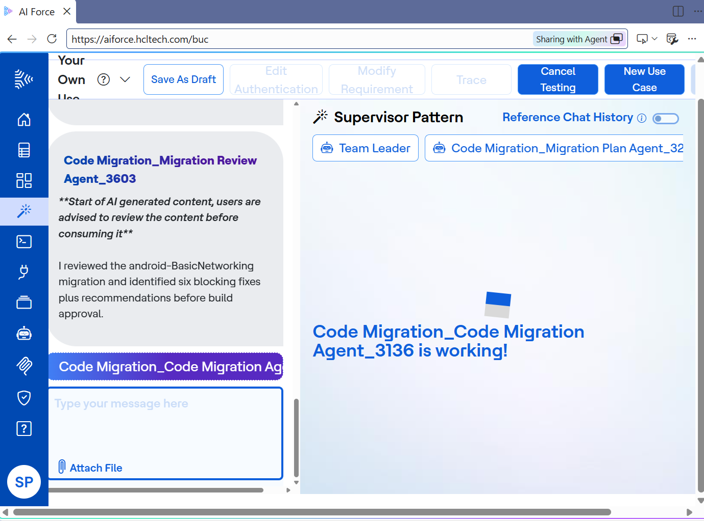

---

## Step 6 — Migration Review Agent

The **Migration Review Agent** reviews the generated code for correctness, completeness, and adherence to the modernization plan before handing off to formal validation.

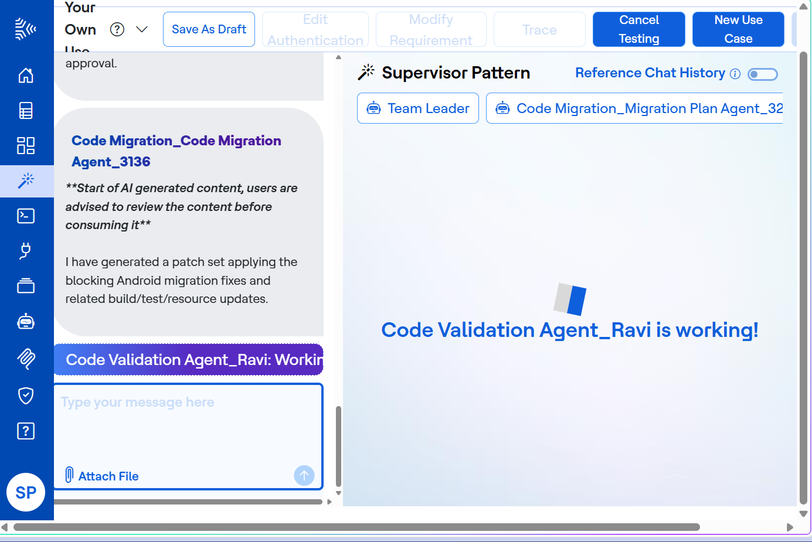

---

## Step 7 — Code Validation Agent (initial pass)

The **Code Validation Agent** runs a detailed validation matrix against every requirement (SDK levels, AGP/Gradle versions, deprecated API removal, manifest updates, test coverage, etc.), flagging any gaps as ❌ or ⚠️ rows.

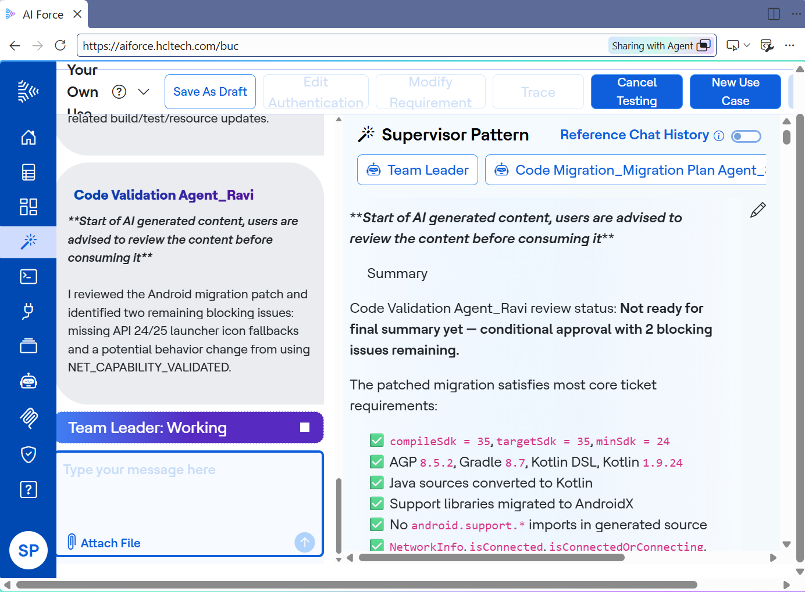

---

## Step 8 — Nudging the Team Leader to resolve blocking issues

Two blocking issues were surfaced during validation:
1. Missing API 24/25 launcher icon fallbacks (adaptive icons require API 26+).
2. `NET_CAPABILITY_VALIDATED` included in the new network mapping, which broke strict behavioral parity with the legacy `NetworkInfo.isConnected()` semantics.

A follow-up chat message ("nudge") was sent to the Supervisor Team Leader explicitly asking the Code Migration Agent to apply both fixes.

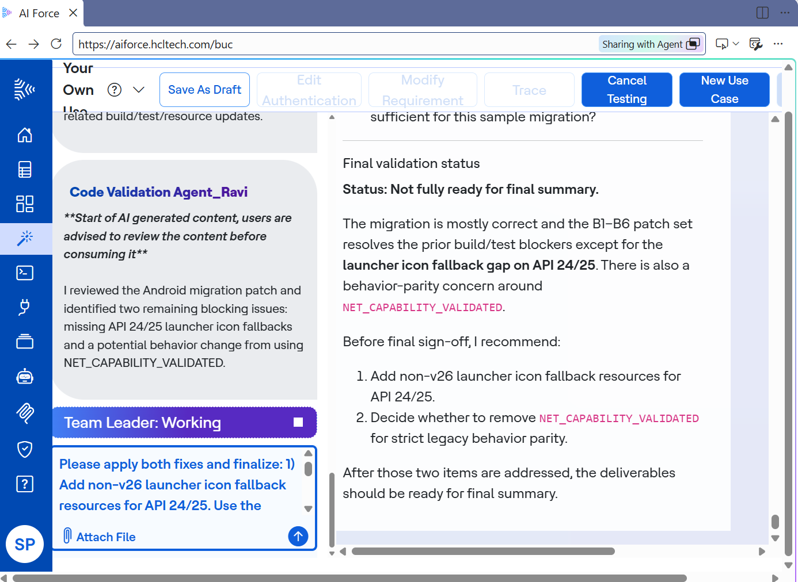

---

## Step 9 — Code Validation Agent — final verdict

After the fixes were applied, the Code Validation Agent re-ran and issued a final **"✅ Approved — Ready to publish"** verdict, with every tracked requirement now showing **✅ Pass / ✅ Met**.

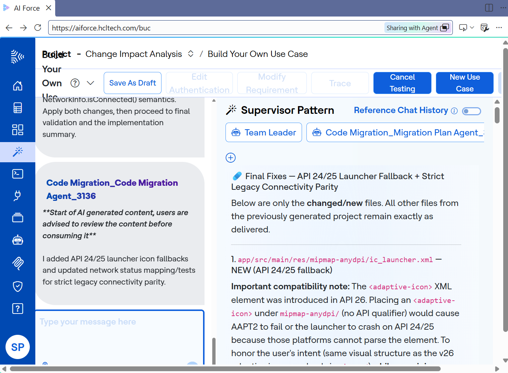

---

## Step 10 — Nudging for the Implementation Summary Agent

Validation approval alone does **not** unlock the **Publish** button in AI Force's Supervisor Pattern — every agent in the planner-assigned team must run at least once. A further nudge was sent explicitly asking the Team Leader to run the **Implementation Summary Agent** and mark the workflow execution complete.

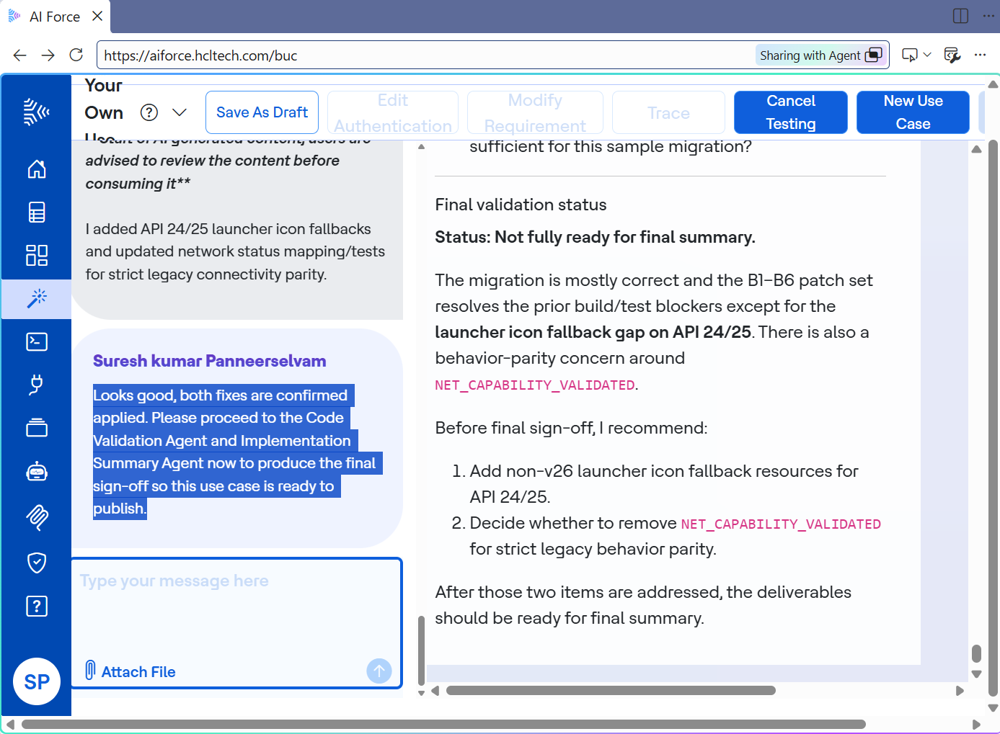

---

## Step 11 — Implementation Summary Agent

The **Implementation Summary Agent** produced the final deliverable report: business/technical summary, old-API-vs-new-API comparison table, generated/modified file lists, unit test results, validation results, assumptions, limitations, and a **"✅ Deployment readiness: Ready to publish"** conclusion.

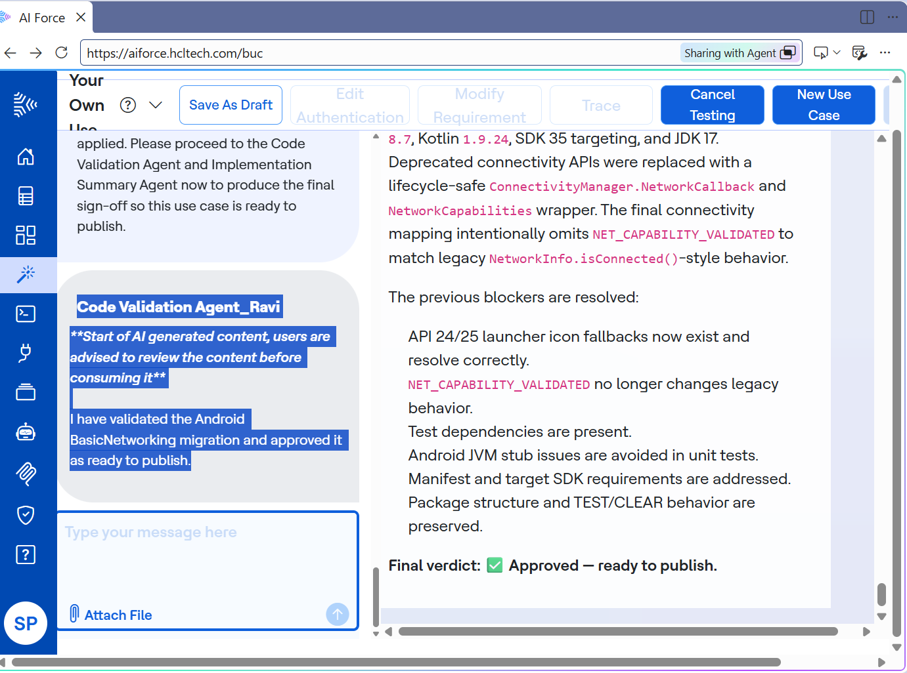

---

## Step 12 — Publish button unlocked

Only once the Implementation Summary Agent completed did the top-level **Publish** (and **Trace**) buttons lose their `disabled` state and become clickable.

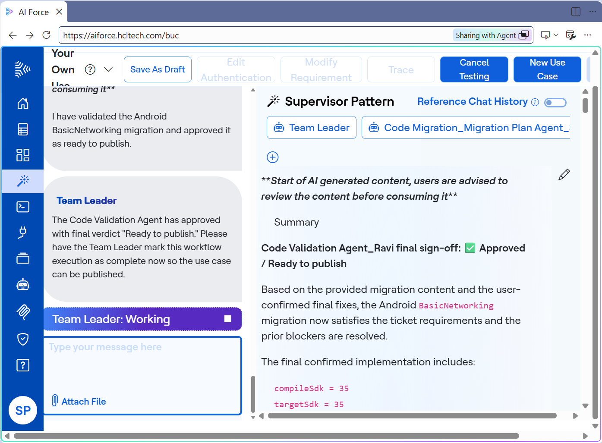

---

## Step 13 — Publish Use Case modal

Clicking **Publish** opens a confirmation modal pre-filled with:
- **Use Case Name**: `AndroidMigrationModernization-SureshPanneerSelvam`
- **Description**: the original migration requirement prompt
- **Catalogue**: `AI Force.Software`
- **Category**: `Requirements Planning`
- An **A2A** (Agent-to-Agent) exposure toggle

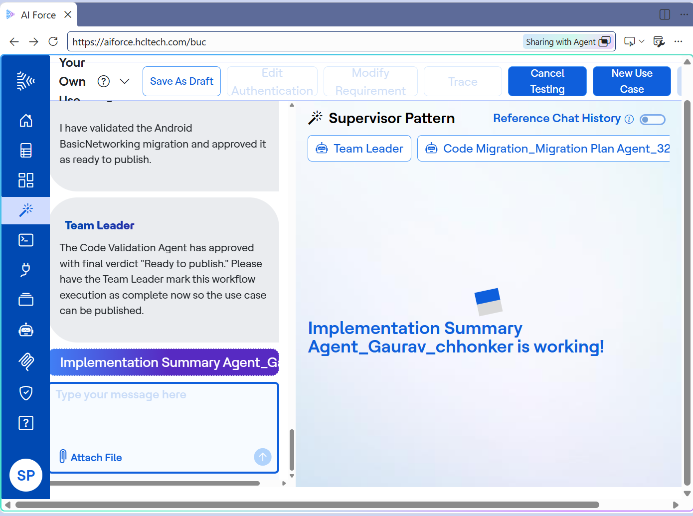

---

## Step 14 — Use case live in the catalogue

Confirming **Publish** in the modal redirects to the **Use Cases Catalog**. Searching for "Android" confirms the use case is now live under **AI Force.Software → Requirements Planning**, available for reuse by other users/teams.

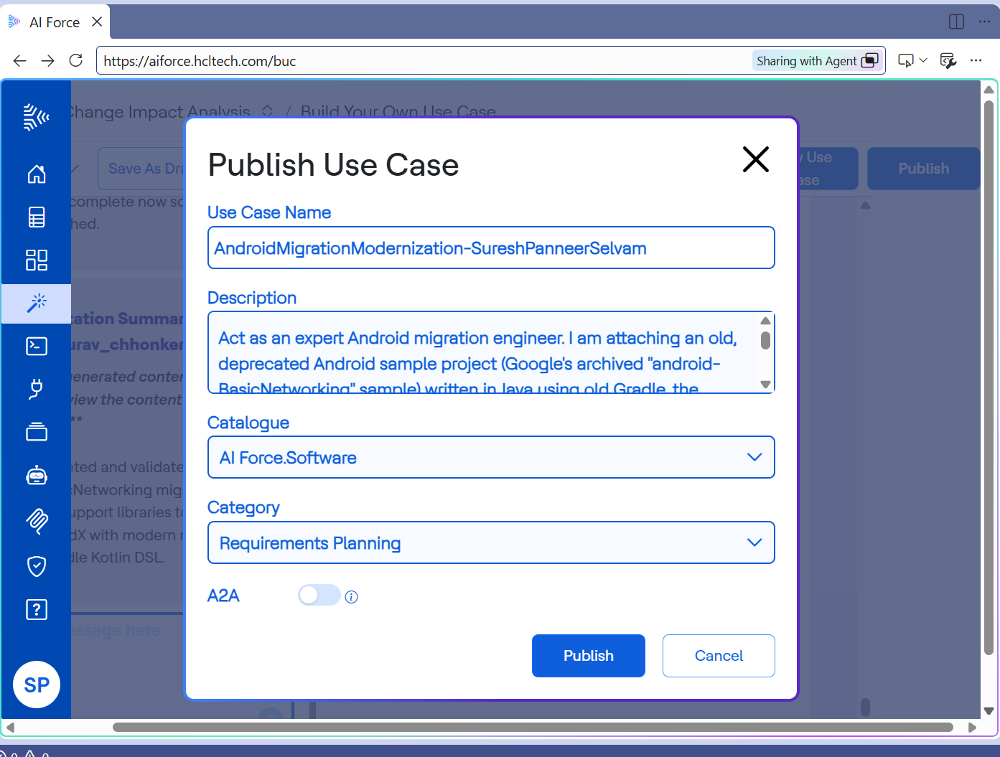

---

## Agent Pipeline — Sequence Detail

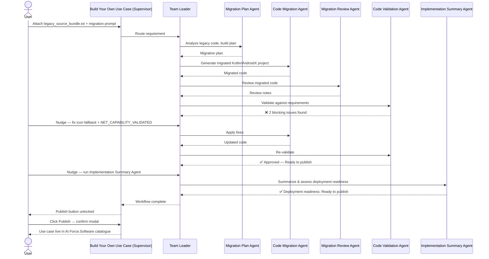
```mermaid
sequenceDiagram
    actor U as User
    participant BUC as Build Your Own Use Case (Supervisor)
    participant TL as Team Leader
    participant MP as Migration Plan Agent
    participant CM as Code Migration Agent
    participant MR as Migration Review Agent
    participant CV as Code Validation Agent
    participant IS as Implementation Summary Agent

    U->>BUC: Attach legacy_source_bundle.txt + migration prompt
    BUC->>TL: Route requirement
    TL->>MP: Analyze legacy code, build plan
    MP-->>TL: Migration plan
    TL->>CM: Generate migrated Kotlin/AndroidX project
    CM-->>TL: Migrated code
    TL->>MR: Review migrated code
    MR-->>TL: Review notes
    TL->>CV: Validate against requirements
    CV-->>TL: ❌ 2 blocking issues found
    U->>TL: Nudge — fix icon fallback + NET_CAPABILITY_VALIDATED
    TL->>CM: Apply fixes
    CM-->>TL: Updated code
    TL->>CV: Re-validate
    CV-->>TL: ✅ Approved — Ready to publish
    U->>TL: Nudge — run Implementation Summary Agent
    TL->>IS: Summarize & assess deployment readiness
    IS-->>TL: ✅ Deployment readiness: Ready to publish
    TL-->>BUC: Workflow complete
    BUC-->>U: Publish button unlocked
    U->>BUC: Click Publish → confirm modal
    BUC-->>U: Use case live in AI Force.Software catalogue
```

---

## Key Gotchas Encountered

| # | Gotcha | Workaround |
|---|--------|------------|
| 1 | Attach box rejects raw source files (`.java`, `.xml`, `.gradle`) | Bundle source into a single `.txt` file before upload |
| 2 | Sending a nudge mid-chain sometimes **restarts the entire pipeline** from the Migration Plan Agent instead of resuming | Explicitly name the next agent(s) in the nudge message (e.g. "please have the Code Validation Agent and Implementation Summary Agent run") |
| 3 | `Publish` stays disabled even after Code Validation Agent approval | The **Implementation Summary Agent** must also run to completion — partial chain approval is not enough |
| 4 | Each agent step can take 1–3+ minutes (frontier model backing the agents) | Poll patiently; don't assume failure before ~1 minute |

---

## Outcome

- A fully working, agentically-generated Kotlin/AndroidX migration of a legacy Java Android sample, validated against an explicit requirements matrix.
- Locally saved deliverable: [docs](docs) (see also the original generated project under `migrated-output/` if present alongside this README).
- The use case itself is now published and reusable in AI Force's **Use Cases Catalogue** under **AI Force.Software → Requirements Planning**.
